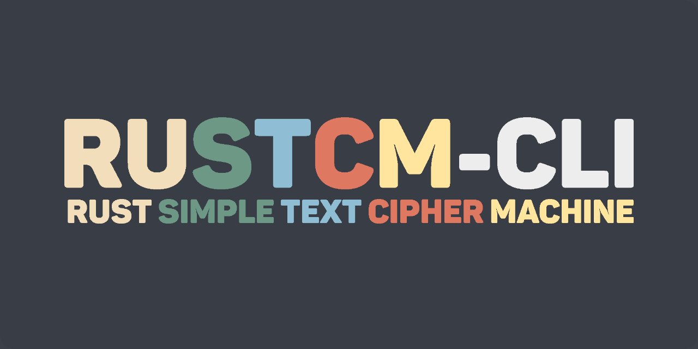

# Rust Simple Text Cipher Machine / ru·s·t·c·m /

## About

Encryption or decryption of UTF-8 encoded text files using the XChaCha20-Poly1305 authenticated cipher. You might come across breaking changes.

## Build

- Install [Cargo](https://github.com/rust-lang/cargo)

- `cargo build --release` to build

- The program binary will be in the `./target/release` directory

## Usage

```
rustcm-cli 0.1.3-alpha
Rust Simple Text Cipher Machine.

USAGE:
    rustcm-cli [COMMAND]

COMMAND:
    -h, --help
        Prints this help message

    -v, --version
        Prints the version information

    -e, --encrypt <path-to-input> <path-to-output>
        Runs the program in encryption mode

    -d, --decrypt <path-to-input> <path-to-output>
        Runs the program in decryption mode
```

## Example


## License

Distributed under the GPLv3 License. See `LICENSE` for more information.

## Contributors

- [Arkaprabha Chakraborty](https://github.com/arkorty)
