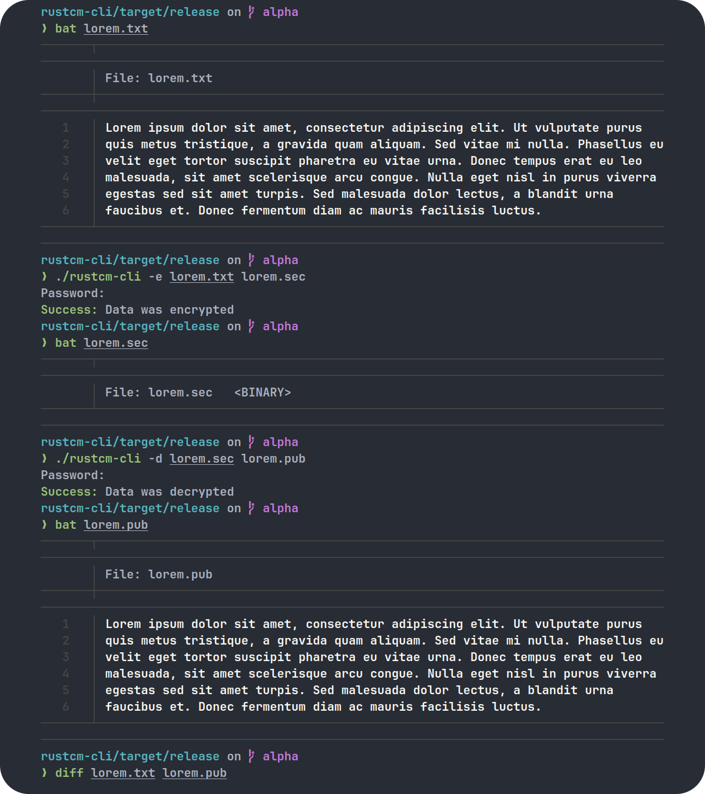

# Rust Simple Text Cipher Machine / ru·s·t·c·m /

## About

It does precisely what the name indicates, i.e., encryption and decryption of UTF-8 encoded files using the ChaCha20-Poly1305 authenticated streaming cipher algorithm. The program is still in its alpha (incomplete) stage, you might come across a lot of bugs.

## Build

* Install [Cargo](https://github.com/rust-lang/cargo)

* `cargo build --release` to build

* The program binary will be in the `./target/release` directory

## Usage

```
rustcm-cli 0.1.0-alpha
Rust Simple Text Cipher Machine

USAGE:
    rustcm-cli [COMMAND]

COMMAND:
    -h, --help
        Prints this help message

    -v, --version
        Prints the version information

    -e, --encrypt <input-path> <output-path>
        Runs the program in encryption mode

    -d, --decrypt <input-path> <output-path>
        Runs the program in decryption mode
```

## Example


## Disclaimer

Do not use this for any high value information. I shall not be held accountable for any damage caused to you by this program. Please use at your own discretion.

## License

Distributed under the GPLv3 License. See `LICENSE` for more information.

## Contributors

* [Arkaprabha Chakraborty](https://github.com/arkorty)
