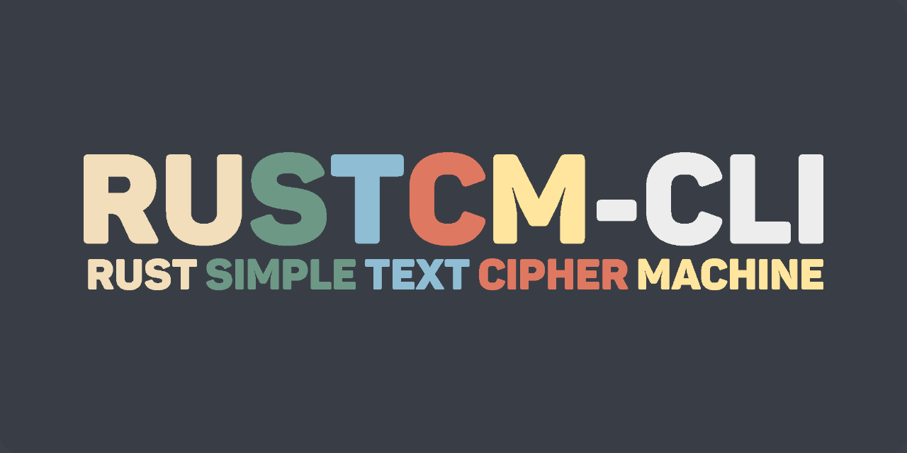

# Rust Simple Text Cipher Machine / ru·s·t·c·m /

## About

Streaming authenticated encryption of any data (text or binary) using XChaCha20-Poly1305 with Argon2id key derivation. Works as a Unix pipeable command.

## Build

- Install [Cargo](https://github.com/rust-lang/cargo)

- `cargo build --release` to build

- The program binary will be in the `./target/release` directory

---

# MANUAL

## NAME

`rscm` — Rust Simple Cipher Machine: streaming authenticated encryption for files and pipes

## SYNOPSIS

```
rscm <COMMAND>
```

Commands:

```
encrypt    Encrypt data (stdin to stdout by default)
decrypt    Decrypt data (stdin to stdout by default)
gen-key    Generate a key file from a password
help       Print help for a subcommand
```

Global options:

```
-h, --help       Print help
-V, --version    Print version
```

## DESCRIPTION

`rscm` encrypts and decrypts arbitrary byte streams (UTF-8 text or binary) using the XChaCha20-Poly1305 authenticated cipher with Argon2id key derivation.

It follows the Unix philosophy:

- **stdout** carries only data — ciphertext when encrypting, plaintext when decrypting. Never status messages, never prompts.
- **stderr** carries diagnostics — errors only. The program is completely silent on success.
- **stdin** carries input when no `-i` is given. **stdout** carries output when no `-o` is given.
- Password prompts are read from `/dev/tty`, never from stdin, so pipes are never disturbed.
- Data is processed chunk-by-chunk with constant memory regardless of input size.
- Honors `NO_COLOR`; colors are emitted only when stderr is a terminal.

## EXIT STATUS

```
0    Success
1    General error (I/O, crypto, KDF failure)
2    Usage error (invalid arguments — emitted by clap)
3    Authentication failure (wrong password, corrupted or truncated data)
4    User input error (password mismatch, invalid key file)
```

## ENCRYPT

### Synopsis

```
rscm encrypt [OPTIONS]
```

### Options

```
-i, --input <FILE>           Read plaintext from FILE instead of stdin
-o, --output <FILE>          Write ciphertext to FILE instead of stdout
-k, --key-file <FILE>        Read a 32-byte key from FILE instead of prompting
    --chunk-size <BYTES>     Chunk size in bytes [default: 65536]
    --memory-kib <KIB>       Argon2id memory cost in KiB [default: 65536]
    --iterations <N>         Argon2id iterations [default: 3]
    --parallelism <N>        Argon2id parallelism lanes [default: 1]
-h, --help                   Print help
```

### Behaviour

1. If `-k` is given, the 32-byte key file is loaded directly (no password prompt).
2. Otherwise a password is prompted twice on `/dev/tty` and must match.
3. A random 32-byte salt and 24-byte nonce are generated.
4. The key is derived from the password using Argon2id with the given parameters.
5. The 71-byte file header is written, followed by length-prefixed encrypted chunks.
6. Output is written to `-o` if given, otherwise to stdout.

### Examples

```bash
# Encrypt a file to another file (prompts for password twice)
rscm encrypt -i plain.txt -o secret.rscm

# Encrypt stdin to stdout (pipeable)
echo -n "hello" | rscm encrypt -k key.bin > secret.rscm

# Encrypt with custom KDF parameters
rscm encrypt -i data.bin -k key.bin --memory-kib 131072 --iterations 4

# Encrypt with small chunks (useful for latency-sensitive pipes)
cat live_stream | rscm encrypt -k key.bin --chunk-size 4096 > out.rscm
```

## DECRYPT

### Synopsis

```
rscm decrypt [OPTIONS]
```

### Options

```
-i, --input <FILE>     Read ciphertext from FILE instead of stdin
-o, --output <FILE>    Write plaintext to FILE instead of stdout
-k, --key-file <FILE>  Read a 32-byte key from FILE instead of prompting
-h, --help             Print help
```

### Behaviour

1. The 71-byte header is read and validated (magic `RSCM`, version, KDF algorithm).
2. KDF parameters and salt are taken from the header — the decryptor does not supply them.
3. If `-k` is given, the key file is loaded. Otherwise a password is prompted once on `/dev/tty`.
4. Chunks are authenticated and decrypted one at a time, streamed to output.
5. Truncation, reordering, or any bit-flip causes an authentication failure (exit 3).

### Examples

```bash
# Decrypt a file to another file (prompts for password once)
rscm decrypt -i secret.rscm -o plain.txt

# Decrypt a file to stdout (pipeable)
rscm decrypt -i secret.rscm -k key.bin | less

# Decrypt stdin to stdout
cat secret.rscm | rscm decrypt -k key.bin > plain.txt

# Full pipe round-trip
echo -n "secret" | rscm encrypt -k key.bin | rscm decrypt -k key.bin
```

## GEN-KEY

### Synopsis

```
rscm gen-key --output <FILE> [OPTIONS]
```

### Options

```
-o, --output <FILE>       Write the 32-byte key to FILE (required)
    --memory-kib <KIB>    Argon2id memory cost in KiB [default: 65536]
    --iterations <N>      Argon2id iterations [default: 3]
    --parallelism <N>     Argon2id parallelism lanes [default: 1]
-h, --help                Print help
```

### Behaviour

1. Prompts for a password twice on `/dev/tty` and must match.
2. Derives a 32-byte key using Argon2id with the given parameters and a random salt.
3. Writes the raw 32-byte key to the output file.

The salt is not stored — the key file contains the final key and is used directly by `-k`. This means the KDF parameters used at generation time do not affect later encrypt/decrypt operations when a key file is used.

### Examples

```bash
# Create a key file interactively
rscm gen-key -o key.bin

# Then use it non-interactively
rscm encrypt -i data.bin -k key.bin -o data.enc
rscm decrypt -i data.enc -k key.bin -o data.bin
```

## KEY FILES

A key file is exactly **32 raw bytes** — no header, no metadata. It can be generated with `gen-key` or produced externally (e.g. `head -c 32 /dev/urandom > key.bin`).

When `-k` is supplied:

- No password prompt occurs (neither encrypt nor decrypt).
- KDF parameters (`--memory-kib`, `--iterations`, `--parallelism`) are ignored for key derivation — the raw key is used directly. For encrypt they are still written to the header (for informational purposes), but decrypt reads them from the header and does not need them when `-k` is used.

## FILE FORMAT

All multi-byte integers are little-endian.

```
Offset  Size  Field
──────  ────  ──────────────────────────────────────────────
0       4     Magic: "RSCM" (0x52 0x53 0x43 0x4D)
4       1     Format version (currently 1)
5       1     KDF algorithm ID (1 = Argon2id)
6       4     Memory cost in KiB
10      4     Iterations
14      1     Parallelism lanes
15      32    Salt (CSPRNG-generated)
47      24    Nonce (streaming AEAD, CSPRNG-generated)
──────  ────  ──────────────────────────────────────────────
71      *     Stream chunks, repeated until Finish:
              ┌────────────────────────────────────────────┐
              │ 4 bytes   Chunk length L (includes 16-byte │
              │           Poly1305 tag)                    │
              │ L bytes   Ciphertext + Poly1305 tag        │
              └────────────────────────────────────────────┘
```

The final chunk carries the `Finish` stream tag (encrypted and authenticated inside the chunk). A missing `Finish` tag indicates truncation.

## ENVIRONMENT

```
NO_COLOR        If set (to any value), disable ANSI color in stderr output.
CLICOLOR_FORCE  If set to a non-zero value, force color even when stderr is not a terminal.
```

## SECURITY

- **KDF**: Argon2id (memory-hard, side-channel resistant). Default: 64 MiB, 3 iterations, 1 lane.
- **AEAD**: XChaCha20-Poly1305 streaming (libsodium secretstream compatible).
- **Truncation detection**: Final chunk tagged with `Finish`; a missing tag causes exit 3.
- **Reordering/tamper detection**: Every chunk is individually authenticated.
- **Nonce reuse prevention**: A fresh 24-byte nonce is generated for every encryption.
- **Key zeroization**: Derived keys are held in `Zeroizing` wrappers and wiped on drop.
- **Password handling**: Read from `/dev/tty` with echo disabled; compared in constant time where applicable; never written to stdout or stdin.

## EXAMPLES

```bash
# --- Basic pipe round-trip ---
echo -n "hello world" | rscm encrypt -k key.bin | rscm decrypt -k key.bin

# --- File to file ---
rscm encrypt -i report.pdf -o report.enc
rscm decrypt -i report.enc -o report.pdf

# --- Generate key, then use it ---
rscm gen-key -o secret.key
rscm encrypt -i secret_data.tar -k secret.key -o secret_data.enc

# --- Chain with other tools ---
cat photo.jpg | rscm encrypt -k key.bin | gzip > photo.enc.gz
gunzip -c photo.enc.gz | rscm decrypt -k key.bin > photo.jpg

# --- Encrypt to stdout, save with redirect ---
rscm encrypt -i diary.txt -k key.bin > diary.enc

# --- Decrypt from stdin ---
cat diary.enc | rscm decrypt -k key.bin

# --- Custom chunk size for streaming ---
tail -f app.log | rscm encrypt -k key.bin --chunk-size 1024 > app.enc

# --- Stronger KDF parameters ---
rscm encrypt -i vault.dat -k key.bin --memory-kib 262144 --iterations 4
```

## SEE ALSO

`gpg(1)`, `age(1)`, `openssl(1)`, `age-keygen(1)`

## TESTING

The project has two test layers, both run with `cargo test`:

- **Unit tests** (`src/`, ~33 tests): KDF derivation, header serialization, streaming round-trips, tamper/truncation rejection, key file I/O, error message formatting.
- **Integration tests** (`tests/cli.rs`, ~26 tests): drive the compiled `rscm` binary end-to-end — pipe round-trips (text, binary, empty), file round-trips, exit codes (0/1/2/3/4), stdout purity, silent success, ANSI-free stderr when not a TTY, wrong-key/corruption/truncation rejection, help/version output.

```bash
cargo test              # run everything
cargo test --lib        # unit tests only
cargo test --test cli   # integration tests only
```

---

## License

Distributed under the GPLv3 License. See `LICENSE` for more information.

## Contributors

- [Arkaprabha Chakraborty](https://github.com/arkorty)
